# Undercloud Install and Preparation by Preparation Expert
Before the edge technician (Jacques) can do his job of installing the OpenStack Overcloud at an edge site, the undercloud needs to be installed and some configuration work needs to take place. This is not part of Jacques role and is captured below as part of a workflow done by what we are calling the "Preparation Expert". Read more about this persona here:

Preparation Expert Persona (TBD)

## Identify and Prepare Hardware for Undercloud

- The Preparation Expert needs to identify and prepare the hardware they will be using to install the undercloud on. They will refer to guidance on what the specifications need to be for this hardware.

## Install Undercloud

- The first step of installing the undercloud is to clone and run the TripleO Quickstart project.

## Clone Heat Templates

- The Preparation Expert clones the heat templates that are provided by the TripleO project so that they can make any edits needed for the configuration for their overcloud environment.

## Edit Heat Templates
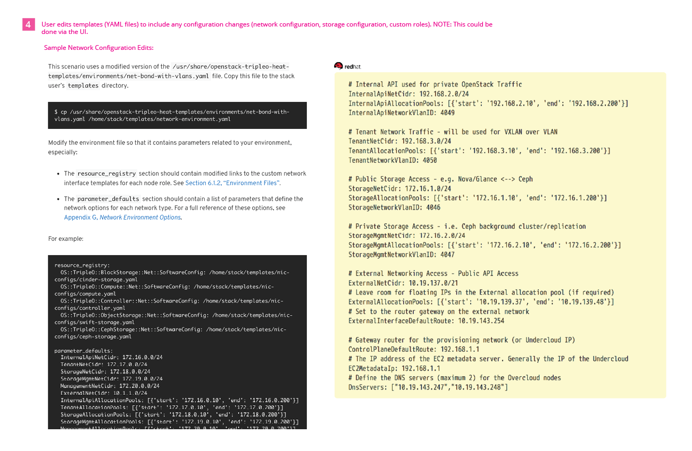
- Any configuration updates that need to be made should be changed in the YAML files. This includes Network and Storage configuration changes along with creating or editing any custom roles that will be used.

## Optionally Create JSON File for Hardware

- The Preparation Expert could optionally create a JSON file based on the hardware that will be registered at the Edge Site. This is something that could be uploaded by the deployer while registering nodes to make it quicker to register in bulk.

## How Would this Flow look in the UI?

The preparation expert could use the UI to do all of these steps after prepping their undercloud hardware and installing the undercloud. Here is what that flow could look like in the UI...

- After logging in, the user would be dropped into the Plans card views. This would show any default plans that are available on a clean install.

- At this point, the Preparation Expert would create a new plan so that they could define the specifics for what will be deployed at the Edge Site.

- On creation of a Plan, the user can choose high level configuration options.  

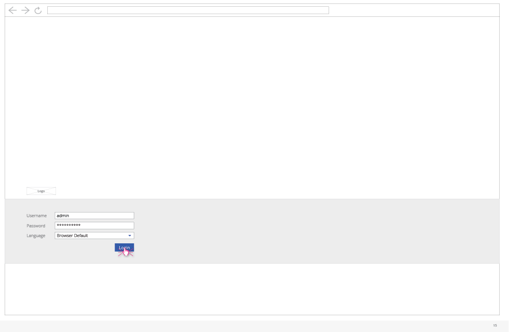
- Part of the overall configuration includes role selection and creation.
- Since this deployment will be an HCI deployment, the user is going to remove the default Compute and Storage roles and go ahead and create custom role for HCI.

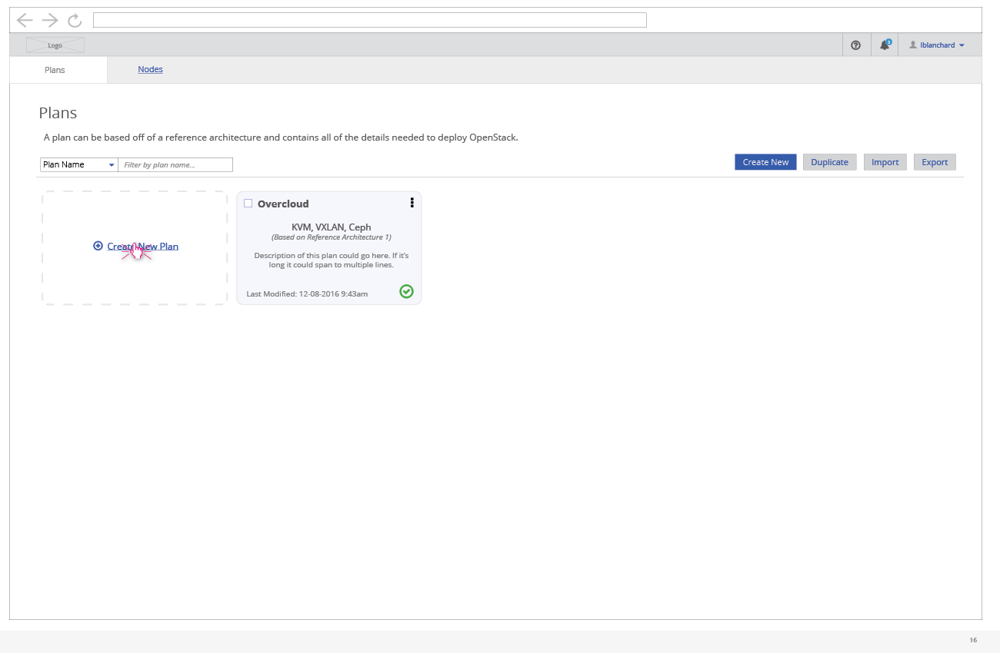
- Creating a new role will pull up another window that allows the user to define that role.

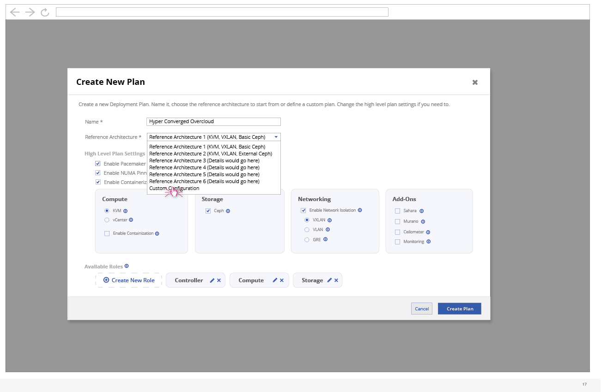
- Roles can be given a name, description, and need to be assigned to a flavor.
- Services can be selected that will be used in this role.
- Based on the services selected, the parameters below will be built out.

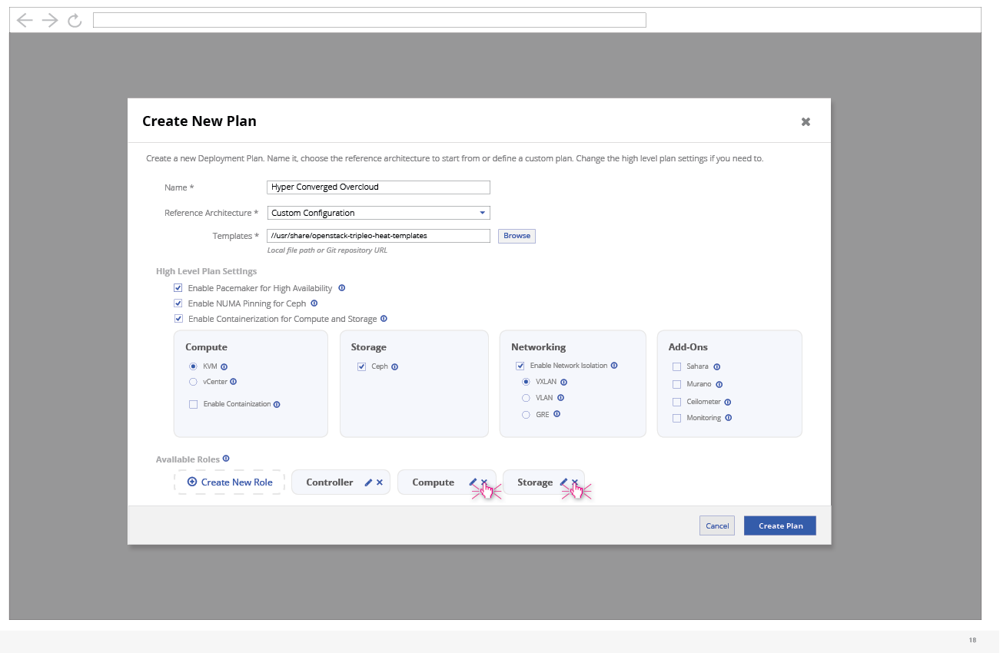
- Once the user has finalized the high level plan details, they can confirm the creation of the plan.

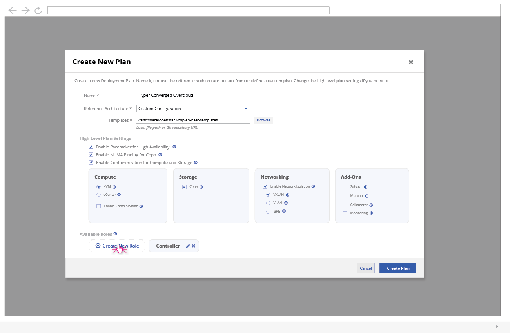
- After creating the plan, the user will see it listed in the card view. Clicking on the card will drill into the detailed workflow of that plan.

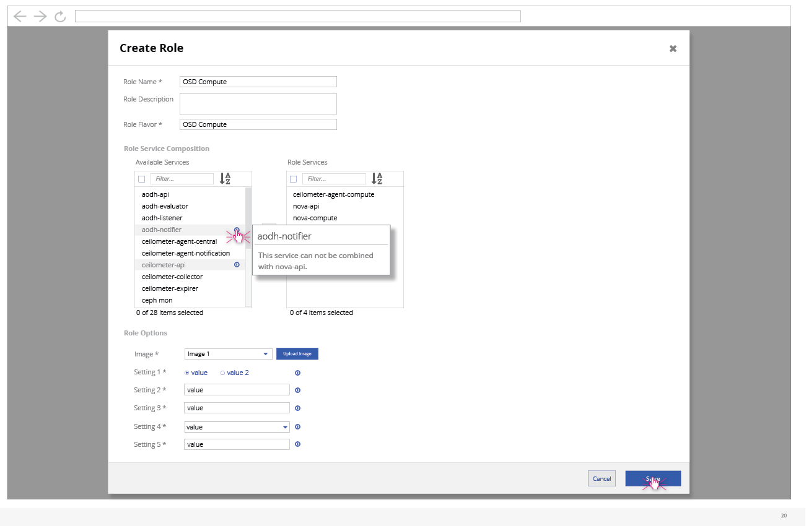
- At this point, the user could choose to edit the configuration for this plan.

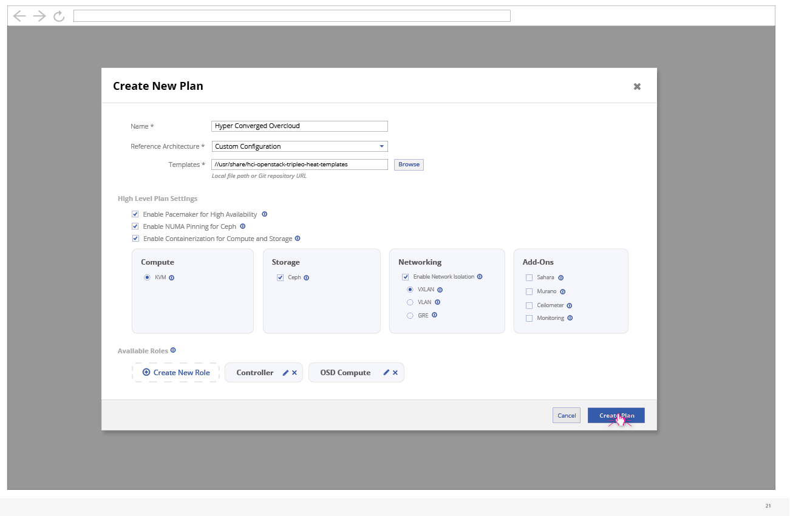
- The user can drill into the advanced network configuration.

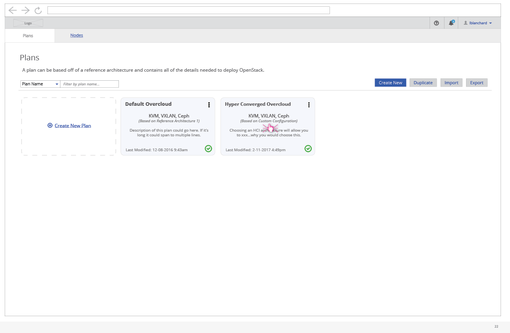
- After making any network configuration changes, the user can drill into the advanced storage configuration.

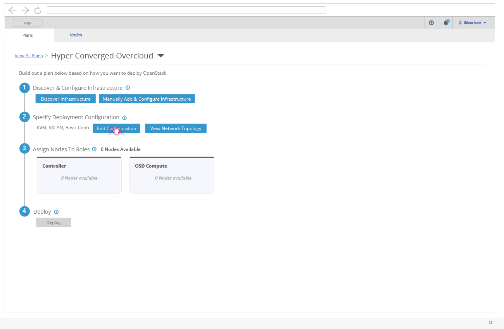
- Storage configuration changes can be made here and the user can save all of the configuration changes that have been made.

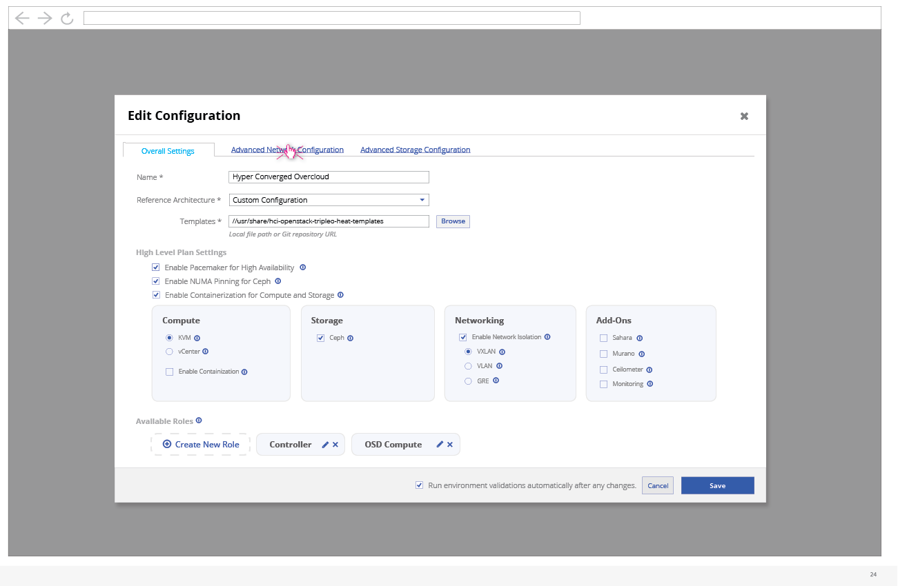
- Validations may kick off after certain changes are made to the deployment configuration.

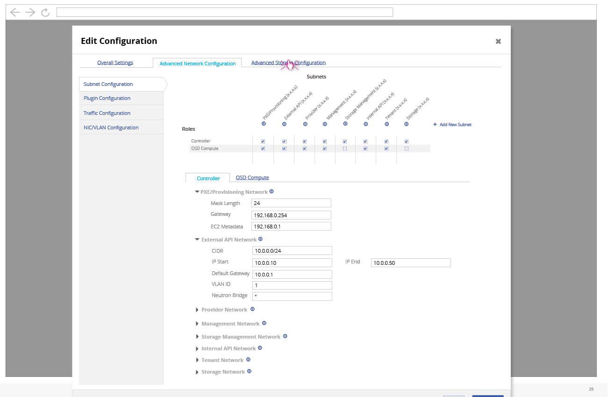
- The user can click to view the entire list of validations.

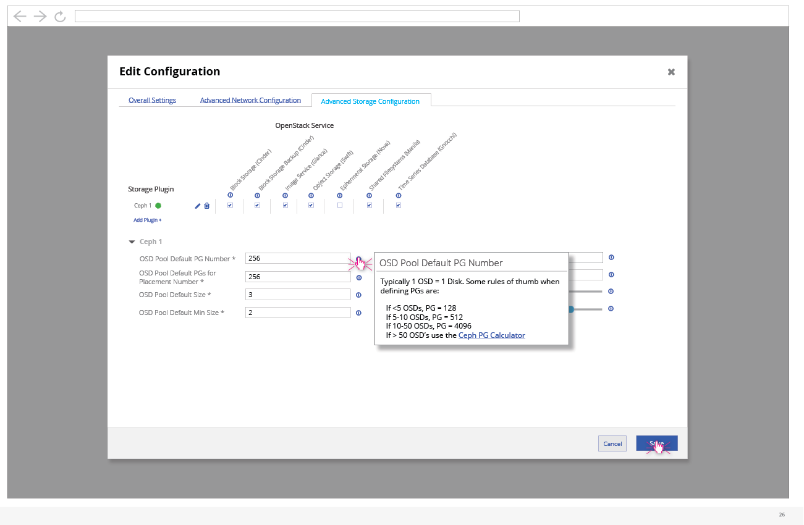
- For each validation, the high level status is listed along with a way for the user to drill into the details of the validation.

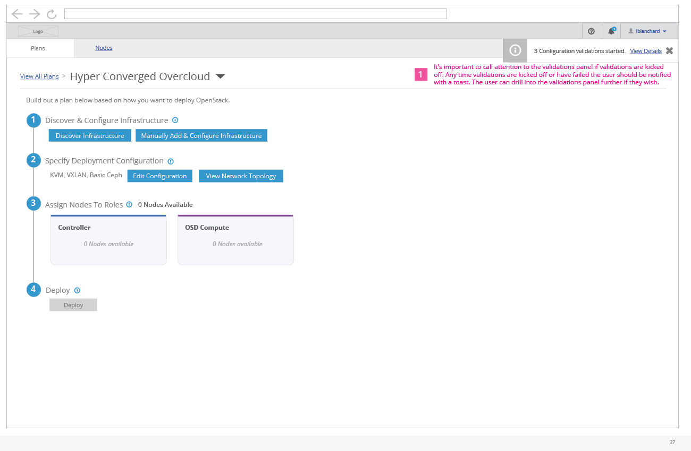
- The validation details will give the user a better idea as to what has happened if a validation failed.
